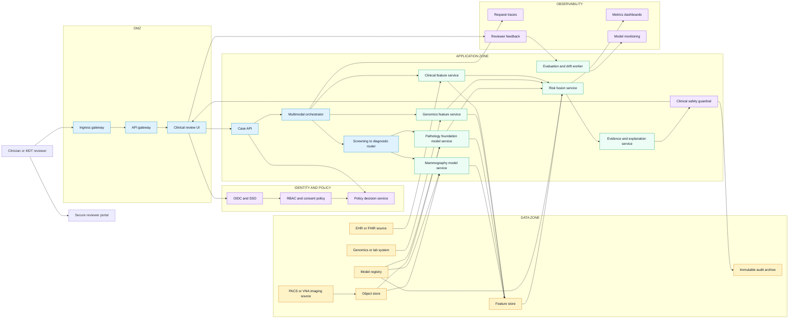
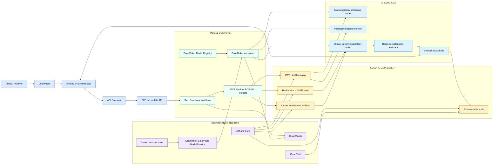

# Architecture Blueprints

These diagrams are designed for GitHub, LinkedIn, and interview walkthroughs. They describe the same project at three levels: what is implemented in this repository, how it maps to a DialogXR-style healthcare platform, and how it could be deployed with AWS managed services.

## 1. Implemented Research System

This is the architecture represented by the code, reports, Slurm jobs, and Streamlit demo in this repository.

```mermaid
flowchart LR
    user["Research user or reviewer"] --> demo["Streamlit research demo"]

    subgraph stage1["STAGE 1 SCREENING"]
        vindr["VinDr-Mammo exams"]
        views["Four-view mammogram inputs"]
        convnext["ConvNeXt-Base encoder"]
        viewattn["View attention fusion"]
        suspicion["Exam suspicion score"]
    end

    subgraph router["TWO-STAGE ROUTER"]
        decision["Surveillance or pathology referral"]
    end

    subgraph stage2["STAGE 2 MULTIMODAL PROGNOSIS"]
        slides["TCGA-BRCA whole-slide images"]
        tiles["Tile extraction and feature extraction"]
        encoders["Pathology foundation encoders"]
        genomics["RNA-seq genomic features"]
        clinical["Clinical covariates"]
        fusion["CONCH V plus C plus G cross-attention"]
        risk["PFI risk score and risk band"]
    end

    subgraph evidence["EVALUATION AND ARTIFACTS"]
        cv["Five-fold cross-validation"]
        km["Kaplan-Meier risk stratification"]
        stats["AUROC, C-index, confidence intervals"]
        reports["Tracked reports and figures"]
    end

    vindr --> views --> convnext --> viewattn --> suspicion --> decision
    decision --> slides
    slides --> tiles --> encoders --> fusion
    genomics --> fusion
    clinical --> fusion
    fusion --> risk --> demo
    risk --> cv
    cv --> km
    cv --> stats
    km --> reports
    stats --> reports
    reports --> demo

    classDef input fill:#E0F2FE,stroke:#0284C7,color:#0F172A
    classDef model fill:#ECFDF5,stroke:#059669,color:#0F172A
    classDef route fill:#FEF3C7,stroke:#D97706,color:#0F172A
    classDef eval fill:#F3E8FF,stroke:#7C3AED,color:#0F172A
    class vindr,views,slides,genomics,clinical,user input
    class convnext,viewattn,encoders,fusion,risk,demo model
    class suspicion,decision route
    class cv,km,stats,reports eval
```

**How to explain it:** The project is a two-stage breast cancer AI research system. Stage 1 screens mammography exams. Suspicious cases are conceptually routed to Stage 2, where pathology image features, genomics, and clinical variables are fused for progression-risk modelling.

## 2. DialogXR-Style Healthcare Platform

This version shows how the same pattern could fit into a secure multimodal company platform. It is intentionally framed as clinical decision support, not autonomous diagnosis.

**How to explain it:** This is where the project can connect to DialogXR. DialogXR can be the secure multimodal review layer: identity, policy, case workflow, image and clinical data connectors, model orchestration, explanation, guardrails, audit, and reviewer feedback. The research models become services inside a governed clinical decision-support platform.

## 3. AWS Managed-Service Topology

This is a production-style AWS mapping for the same two-stage workflow.

**How to explain it:** AWS HealthImaging stores imaging data, HealthLake or FHIR integrations handle clinical context, SageMaker hosts custom medical imaging and fusion models, Bedrock can support explanation and controlled summarisation, and governance is handled through IAM, KMS, CloudWatch, CloudTrail, model monitoring, and guardrails.

## Design Decisions to Defend

| Decision | Why it matters |
| --- | --- |
| Two-stage workflow | Mirrors a realistic pathway: population screening first, deeper multimodal workup second |
| Four-view mammography fusion | Mammography exams are not single images; CC and MLO views need exam-level aggregation |
| Foundation encoder comparison | Shows that pathology representation choice changes downstream survival performance |
| Patient-aligned multimodal fusion | Avoids mixing unlinked image, genomic, and clinical records |
| Five-fold cross-validation | Makes the Stage 2 result more defensible than a single split |
| Kaplan-Meier analysis | Translates continuous risk scores into clinically interpretable risk groups |
| Guardrails and audit | Essential because the system is decision support, not autonomous clinical diagnosis |

## Sources for AWS Mapping

- AWS HealthImaging documentation: https://docs.aws.amazon.com/healthimaging/
- AWS HealthLake documentation: https://docs.aws.amazon.com/healthlake/
- Amazon SageMaker deployment documentation: https://docs.aws.amazon.com/sagemaker/latest/dg/deploy-model-get-started.html
- Amazon Bedrock Guardrails documentation: https://docs.aws.amazon.com/bedrock/latest/userguide/guardrails.html
