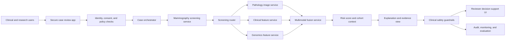

# Enterprise Reference Architecture

This document translates the research codebase into an enterprise healthcare architecture and shows how the project could fit into a governed clinical decision-support platform such as DialogXR.

## Executive Summary

The project demonstrates a two-stage breast cancer AI workflow:

1. **Stage 1 screening:** four-view mammography model over VinDr-Mammo, with a final test AUROC of `0.7407`.
2. **Stage 2 prognosis:** TCGA-BRCA pathology, clinical, and genomics fusion for Progression-Free Interval risk modelling, with best C-index `0.6093 +/- 0.0441` using CONCH V+C+G cross-attention.

In an enterprise setting, this should be positioned as a **multimodal clinical decision-support and research platform**, not an autonomous diagnostic system.

## Reference Architecture

## Runtime Layers

| Layer | Responsibility |
| --- | --- |
| Ingestion | Connect to PACS/VNA, EHR/FHIR, genomics files, curated research cohorts, and benchmark datasets |
| Preprocessing | Normalize images, extract mammography views, tile pathology slides, align clinical/genomic records |
| Feature extraction | Generate image embeddings with pathology foundation encoders and mammography CNN features |
| Fusion | Combine vision, clinical, and genomic signals with cross-attention or late-fusion models |
| Routing | Use the screening layer to separate routine surveillance from deeper diagnostic workup |
| Explanation | Show model inputs, risk band, modality contributions, cohort metrics, and limitations |
| Safety | Apply policy checks, confidence thresholds, missing-modality checks, and human review gates |
| Audit | Log model version, input checksums, features, predictions, explanations, reviewer action, and feedback |
| Evaluation | Track AUROC, C-index, calibration, subgroup behavior, drift, and reviewer override rate |

## DialogXR Integration

DialogXR can be positioned as the enterprise layer around this research system.

| DialogXR-style capability | How this project maps |
| --- | --- |
| Secure practitioner workspace | Streamlit demo becomes a governed case-review UI |
| Multimodal orchestration | Stage 1 screening and Stage 2 prognosis become model services behind an orchestrator |
| Public-sector or healthcare workflow | The router models a real workflow: screening to further workup |
| Human-in-the-loop review | Outputs are explanations and risk context, not automated decisions |
| Governance and audit | Every prediction should carry model version, input provenance, and reviewer outcome |
| Evaluation discipline | Existing AUROC, C-index, confidence intervals, KM curves, and subgroup analysis become monitoring templates |

The enterprise framing is:

> The model should not be dropped directly into clinical workflow. It should be wrapped in a governed platform with identity, consent, provenance, safety thresholds, audit logs, clinical review, and continuous evaluation.

## AWS Mapping

| Architecture layer | AWS service pattern | Purpose |
| --- | --- | --- |
| Imaging store | AWS HealthImaging or S3 with DICOM metadata | Store mammography and pathology image artifacts |
| Clinical data | AWS HealthLake or FHIR-compatible data store | Store clinical variables and patient timeline context |
| Genomics artifacts | S3, Glue Data Catalog, Lake Formation | Store RNA-seq features and derived genomic signals |
| Batch preprocessing | AWS Batch, ECS GPU workers, Step Functions | Tile slides, preprocess mammograms, extract features |
| Custom model hosting | Amazon SageMaker endpoints or batch transform | Serve mammography, pathology encoder, and fusion models |
| Model registry | SageMaker Model Registry | Track model versions, approval status, and deployment metadata |
| Explanation layer | Amazon Bedrock or a controlled LLM endpoint | Generate controlled summaries from model outputs and evidence |
| Guardrails | Bedrock Guardrails, custom clinical rules, threshold checks | Prevent unsupported claims and route low-confidence cases to review |
| Monitoring | CloudWatch, CloudTrail, SageMaker Model Monitor, Clarify | Track latency, cost, drift, performance, bias, and operational events |
| Audit archive | S3 Object Lock, KMS, lifecycle policies | Preserve immutable audit records and model evidence |

## Guardrail Design

Clinical AI guardrails should be stricter than generic GenAI guardrails.

- **Scope guardrail:** the system must describe itself as decision support, not a diagnostic authority.
- **Evidence guardrail:** every output must show the source modalities used and missing modalities.
- **Confidence guardrail:** low-confidence, missing-input, or out-of-distribution cases route to manual review.
- **Clinical language guardrail:** outputs avoid definitive treatment instructions.
- **Equity guardrail:** subgroup metrics are monitored where labels and cohort sizes allow it.
- **Audit guardrail:** every prediction stores model version, feature provenance, and reviewer action.

## Operational Metrics

Track these beyond model score:

- Stage 1 AUROC, sensitivity at fixed specificity, specificity at fixed sensitivity, Brier score
- Stage 2 C-index, time-dependent AUC, calibration, log-rank separation
- Missing-modality rate
- Prediction latency per modality
- Batch feature extraction throughput on GPU workers
- Reviewer override rate
- Guardrail escalation rate
- Subgroup performance by density, site, scanner, age band, or cohort where available
- Data drift and embedding drift

## Limits to State Clearly

- This is a research benchmark and reference architecture, not a clinically validated product.
- Stage 1 and Stage 2 use different public datasets and are connected as a deployment pathway, not as one patient-linked clinical trial.
- Stage 2 performance is statistically meaningful but modest; the value is in rigorous multimodal benchmarking and architecture.
- Any real deployment would need prospective validation, regulatory review, clinical safety testing, and hospital data integration.
